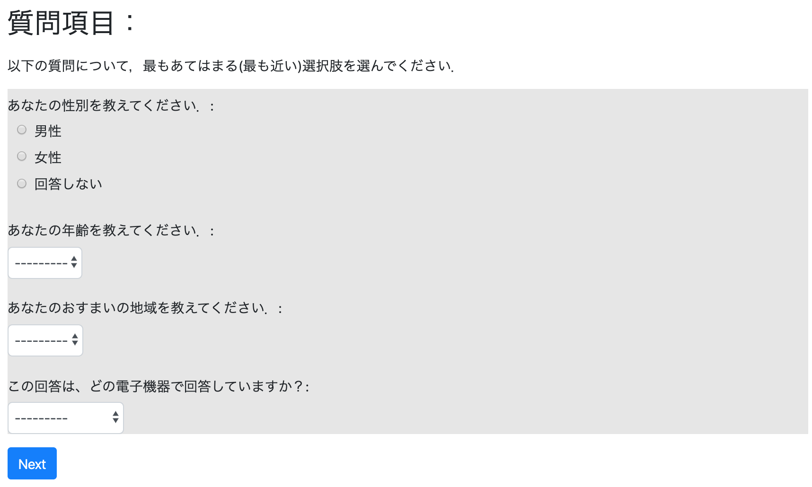

# プログラム①：質問項目


## これから作る実験プログラムの概要：

* 質問紙（1人プレイヤー）
* 質問項目
  * 性別（ラジオボタン）
  * 年齢（選択）
  * 居住都道府県（選択）
  * 回答に使う端末（選択）
* ページは1ページ
  - Page1：項目を入力するページ
     <br><br>


## アプリを作成する

* その前にフォルダを移動します．
  * Windowsの場合
  ```
  cd C:¥Users¥[PC名]¥Desktop¥otreetest
  ```

  * Macの場合
  ```
  cd Desktop/otreetest
  ```


* 土台となるアプリを作成します．
```
otree startapp questionnaire
```


## modelsの定義：
* models.pyでは動作を定義します．

### 追加のパッケージ

```Python
from django import forms
```
* selectをラジオボタンじゃなくて，複数の中から選ぶために必要です．

```Python
from otree.api...
```
のひと固まりの後に入れておきましょう．


### Constantsクラスの定義：基本設計

* questionnaireフォルダ内のmodels.pyを開く
* Constantsクラスの中で人数・繰り返し回数・初期保有額・係数を設定する．

```Python
class Constants(BaseConstants):
    name_in_url = 'questionnaire'
    players_per_group = None # 1人の時は"None"と記述します．
    num_rounds = 1 # 1回だけ質問します．
```
  - `names_in_url`，`players_per_group`，`num_rounds`はoTree上で定義されているため，任意の変数名として使うのは望ましくない


### Playerクラスの定義：

* Playerクラスの中で，各プレイヤーに関する変数を定義する．
```Python
class Player(BasePlayer):
    q_gender = models.CharField(initial=None,
                                choices=['男性', '女性', '回答しない'],
                                verbose_name='あなたの性別を教えてください．',
                                widget=widgets.RadioSelect())
    q_age = models.PositiveIntegerField(verbose_name='あなたの年齢を教えてください．',
                                        choices=range(0, 125),
                                        initial=None)
    q_country = models.CharField(initial=None,
                                choices=['北海道', '青森県', '岩手県', '宮城県', '秋田県', '山形県', '福島県','茨城県', '栃木県', '群馬県', '埼玉県', '千葉県', '東京都', '神奈川県','新潟県', '富山県', '石川県', '福井県', '山梨県', '長野県', '岐阜県', '静岡県', '愛知県', '三重県','滋賀県', '京都府', '大阪府', '兵庫県', '奈良県', '和歌山県','鳥取県', '島根県', '岡山県', '広島県', '山口県','徳島県', '香川県', '愛媛県', '高知県','福岡県', '佐賀県', '長崎県', '熊本県', '大分県', '宮崎県', '鹿児島県', '沖縄県'],
                                verbose_name='あなたのおすまいの地域を教えてください．',
                                widget=forms.Select())

    q_tanmatsu = models.CharField(initial=None,
                                choices=['パソコン',
                                        'タブレット',
                                        'スマートフォン',
                                        'それ以外'
                                        ],
                                verbose_name='この回答は、どの電子機器で回答していますか？',
                                widget=forms.Select())
```
  - 


### Groupクラスの定義
* 今回はプレイヤー同士のインタラクションはないので，特に定義しません．

```Python
class Group(BaseGroup):
   pass
```

### Subsessionクラスの定義

* 今回はプレイヤー同士のインタラクションはないので，特に定義しません．

```Python
class Subsession(BaseSubsession):
    pass
```


## templatesの定義：

* templatesでは具体的な項目を表示するページに決めていきます．

* `questionnaire/templates/questionnaire`の中に`Page1.html`というhtmlファイルを作成します．
  * 既に存在している`MyPage.html`を書き換えるだけで構いません．


### ページ

```html




    質問項目：




<div>
    <p>
        以下の質問について，最もあてはまる(最も近い)選択肢を選んでください．<br>
    </p>
</div>

<div style="background-color:#e6e6e6;">
    
    
    
    
</div>


    



```


### 簡単な説明

```html

    質問項目：

```

* ウェブページにおける「タイトル」を設定します．


```html

    ...

```

* この中に実際の質問項目を記述します．


```html
  
  
  
  
```

* 何らかの入力を求める項目には``と記述します．
  * 今回の場合はplayerクラスの中で定義した入力を求めるので，`player.`という書き方をしています．


```html
  
```
* 「次へ」のボタンです．
  * このボタンをクリックすると，次の画面へ進みます．


## pagesの定義：

* `pages.py`では「ページの表示順」や「入力項目」，**「関数の計算の順番」** などを設定します．
  - 実は **「関数の計算の順番」** が重要．
- しかし，今回は関数の計算が存在しないので気にしなくて良い．
  
* `pages.py`で設定する動作
  - `Page1.html`の中身を定義する．
    - 入力する項目を表示する．

### Page1について
* `Page1`では質問項目への回答の入力があります．
  - 入力画面を作ってあげましょう．


```Python
class Page1(Page):
    form_model = 'player'
    form_fields = [
    'q_gender',
    'q_age',
    'q_country',
    'q_tanmatsu'
    ]
```

### 表示する順番を定義する

* 一番最後に画面を表示する順番を定義します．

```Python
page_sequence = [Page1]
```


## settingにおけるsession configsの定義：

* oTree で実験を実装するには，`settings.py`の中の`SESSION_CONFIGS`にアプリを登録する必要があります．

```Python
SESSION_CONFIGS = [
    dict(
        name='questionnaire',
        display_name="はじめての質問紙",
        num_demo_participants=1, # ここでデモ用に参加する人数は定義しておく必要があります．
        app_sequence=['questionnaire']
    ),
]
```


## サーバとして起動
* 自身の端末をサーバとして起動します．
```Python
otree devserver
```
  - これで自身の端末で実験を実施することができます．
  - [http://localhost:8000/](http://localhost:8000/)にアクセスしてみてください．


## 全てのコード

  [ダウンロード](questionnaire.zip)
