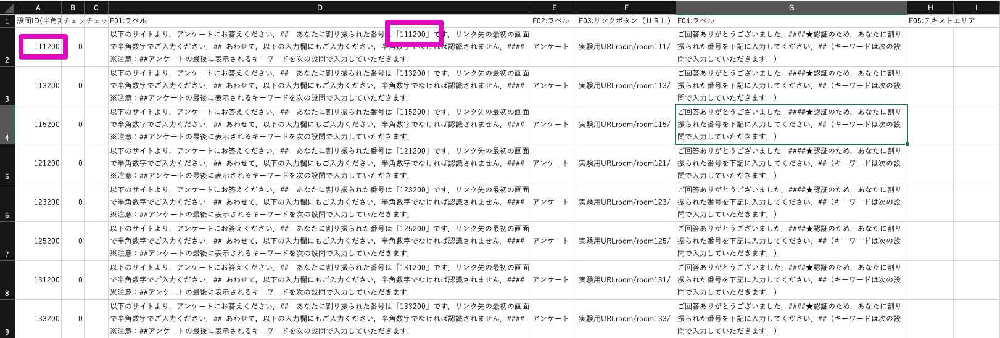

## Y!クラウドソーシングでタスクを発注しよう

## 今日やること

### 絶対にやること

* 経済ゲーム実験の発注
* 成果報酬用タスクの発注
* Tips

## 今日できないこと

* Y!クラウドソーシングの契約
  * 奥川さんに直接ご連絡をお願いいたします．
* 普通のアンケートの発注
  * 奥川さんのパートでお話いただけているかと思います．

## 経済ゲーム実験の発注

---
### 確認：ここでいう経済ゲーム実験とは
* いわゆるゲーム実験だが，特に「成果報酬を支払う場合＝Y!クラウドソーシング上でのIDとゲーム実験上のIDを連結する必要がある場合」を指している．

## タスク情報の入力

* Y!クラウドソーシングのタスク作成画面に入ってからを説明します．

### Step 1：タスク説明情報

* カテゴリーでデータチェックを選びます．
* 「テンプレートを選択する」をクリックします．

* 「テンプレート」はNo.15を設定します．
  * このテンプレートで選択した形式で実験参加者に画面が表示されます．

* 「タスク名」と「タスク説明文」を設定します．

#### 今回は以下の文章としました．

* タスク名

  > 人工知能との付き合い方に関する実験

* タスクの説明文

  > これは人工知能との付き合い方に関する実験です．
  >
  >
  > １．研究の目的
  > このアンケートでは，みなさんが「人工知能エージェント」に対して，どのように反応するのかを調査します．また，一部には実験的な要素も含まれております．別リンクに飛んで問題文をよく読んで実施いただけると幸いです．
  >
  > ２．実験参加者として必要とされること
  > 実験参加者として必要とされることは，これから行われる各項目への回答です．また，最後にキーワードを提示します．そのキーワードをY!クラウドソーシング上の画面に入力することでPayPayボーナスライトを獲得することができます．
  > 最後まで回答してキーワードの入力までを完了させた方には，実験結果に応じて最大で150ポイントを付与します．
  > この追加ポイントは1週間以内に付与しますので，Y!クラウドソーシングの画面を適宜確認しておいてください．
  >
  > ３．研究において実験参加者が受ける可能性のあるリスク
  > 本研究で得られたアンケートの結果は，本研究の目的のためにだけ使用されます．また，本研究では，住所や氏名など個人が特定されるような情報を実験実施者は獲得しません．そのために，アンケート参加者が受ける個人情報の保護に対するリスクはほぼ皆無であると考えられます．
  >
  > なお，タスク画面で各個人に割り振られたIDを入力することで，実験への参加に同意いただいたものとします．
  >
  > 調査結果は教育・研究目的にのみ利用し，それ以外の目的に利用することはありません．
  > また，各個人が特定されることもございませんので，安心してご回答ください．

### Step 2：ポイント進呈方式の設定

* チェック設問を利用することをオススメします．
  * 普段はoTree上の最後の画面で「キーワード」を表示しています．
  * その「キーワード」を入力or選択をして正解することで，最後まで実験に参加したことの確認としています．
  * 途中離脱してもポイントを得られるようにする場合には，「チェック設問を利用せず，タスク実施社全員にポイント進呈」を設定する必要があります．

### Step 3：タスク数とオプション設定

* 設問数は実験を実施する人数分を設定します．
* 1タスクあたりの設問数は「2」とします．
  * チェック設問を含むと，最低で設定できる設問数が「2」になるため．
* タスクの重複出題回数は「1」とします．
  * 2以上にすると，同じIDが複数回表示されることになります．
* 謝礼ポイントは「キーワード」を入力or選択をして正解した人＝最後までタスクを実施した場合に得られるポイントを設定しています．
  * 画面では合計5ポイントとしていますが，もう少し考える必要があるかもしれません．

* ポイント進呈オプションを設定しています．
* 性別・年齢・地域を指定することができます．
  * 地域は「地域」単位および「都道府県」単位で設定できます．

### 【確認】タスク数とお見積金額

* 金額を確認します．

### Step4：タスク設定

* 目安時間として，実験を実施した際に予想される時間を設定します．
* 制限時間は普段60分にしていますが，もしかしたらもっと制約を厳しくしても良いかもしれません．
* 掲載日数は14日間にしていますが，実際にはそこまで長くなりません．
  * タスクの性質として，「留置」しておく必要がある場合にはこれをうまくつかいましょう．
* タスク実施上限を1以上にすると，同じ人が複数回実験に参加できてしまいます．
* タスク実施可能デバイスはパソコンとスマホにしています．
  * スマホでアクセスされる方が多いので，スマホを前提とした実験画面の作り方をしてもよいかと思います．
* オーナー名は，私は普段は設定していません．
  * 職場名が表示されます．しかし，誰が実験しようとしているのかがわかってしまう（調べられてしまう）のであまり表示していません．
* 「前の設問へ戻る」は特にどちらでも良いように思います．
  * oTree上で実験する分には問題ないように思います．

### タスク情報の入力内容の確認画面

* 画面を確認します．

## 設問データ入稿ファイルアップロード

* 実験画面のURLとIDは以下の手順でアップします．

### アップロード画面

### ファイルの作成

* txtファイルをたたき台とします．
  * たたき台ファイルは[コチラ](upload.txt)
  * ダウンロードしてEXCELで開かれると良いと思います．
* ポイントは「設問ID」と「割り振られた番号」を一致させておくことです．
  * 直接URLにIDを埋め込んでも良いのですが，しっかりコピペ等ができるかの確認になるとも思います．

* 下に10問程度のチェック問題の回答を入れておきます．
  * 最低でも10問入れないといけないらしいので，同じ設問を10問入れています．

### 再びアップロード画面

* ファイルを選択してからアップロードします．

* 通知でアップロードできたことを確認できます．

### 発注前の画面確認

* 「掲載プレビュー」で募集がどのように行われるのか確認できます．

* 「作業プレビュー」でタスクがどのように表示されるのか確認できます．

* 以上の内容を確認できたら，「審査依頼」を出します．

* 実験タスクの発注は以上です．

### 実験の終了後に得られるファイル

* 以下のようなファイルを獲得できます．
  * 一番右の列にY!クラウドソーシング上で各参加者に割り振られた番号が表示されています．
  * 一番左の列の「設問ID=実験参加者ID」を紐付けることで，各個人と実験結果を連結できます．

## 成果報酬タスクの発注

### 確認：ここでいう成果報酬タスクとは

* 経済ゲーム実験を実施した後に，成果報酬を支払う必要があります．

* 実際には，ここで述べたタスクを複数（報酬の種類の分）作成することになります．

  

### Step1：タスク説明情報

* カテゴリーで「アンケート」を使います．

* タスク名

  > 人工知能との付き合い方に関する実験に関する成果報酬

* タスク説明文

  > 過日は「人工知能との付き合い方に関する実験に関する成果報酬」にご参加いただき誠にありがとうございました．
  >
  >
  > この連絡が届いた方には成果報酬として「30ポイント」を付与いたします．
  >
  > 今後とも，どうぞよろしくお願いいたします．

### Step2：ポイント進呈方式の設定

* ここでは該当する人にしかポイントを与えないように設定するので，「チェック設問を利用せず，タスク実写全員にポイント進呈」を選びます．

* 人数は該当者の人数以上を50人単位で設定します．
  * 仮に30名が該当者であったとしても50人で設定します．
  * 最終的に30名であった場合には30人分の費用が請求されます．

### Step4：タスク設定

* 単純な質問なので1分にしました．
* 「ホワイトリスト」で特定の方が回答できるようにします．

### ホワイトリストの作成

* 先程の実験結果を元に，ID毎に成果報酬を割り振ります．

* 設定をクリックします．
  * その前に一時保存をしておきましょう．

* ホワイトリストをカンマ区切りで流し込みます．

* ホワイトリストを設定します．

### Step4：再びタスク設定

* タスク情報の登録は以上です．

  

### 設問入稿画面

* 続いて，報酬を受け取るためのタスクを用意します．

  * このアンケート機能を使ってアンケートを作成することもできます．

  

* 簡単な設問を入れるだけなので，No.9を選びます．

* 成果報酬の受け取りを確認するだけのタスクを作成します．
* 内容を確認したら「設問入稿確認画面へ」をクリックします．

### 設問設定内容確認画面

* 設問が設定したとおりであることを確認します．

### 発注前の画面確認

* 掲載プレビューでどのように掲載されるかを確認します．

* 作業プレビューでどのような作業画面かを確認します．

* 問題がないようであれば，審査依頼を出しましょう．

以上で成果報酬の発注は以上です．

## Tips

* 成果報酬支払いの時には「複製タスク作成」を使うと，楽に複数タスクを発注できます．

* 審査依頼の前にメールでY!に連絡することをオススメします．
  * 審査の際にリンクを踏まれます．一度踏まれてしまうと実験が始まってしまうので困ったことになります．
  * 別途，リンクを用意してY!に送っておきます．
  * もしくは，審査に通過した旨の連絡があった後に`otree resetdb`と`otree prodserver 80`で再起動してルームを設定する，という手もありますが好ましい手段ではありません．
* プログラムは途中離脱が生じても止まらないように組みましょう．
  * 特にインタラクションのある経済ゲーム実験の場合，1人が抜けてしまうと同じグループの他の人まで影響が及んでしまいます．
  * 抜ける前提でプログラムを組まれたほうが良いかと思います．
  * 最初はインタラクションなしの実験で様子を見られることをオススメします．

## お疲れさまでした．

