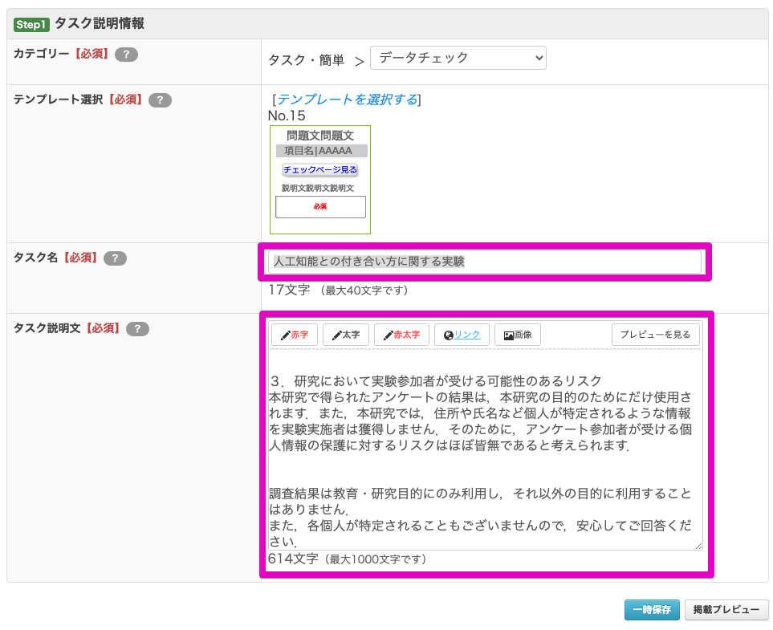
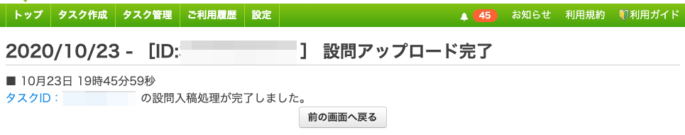
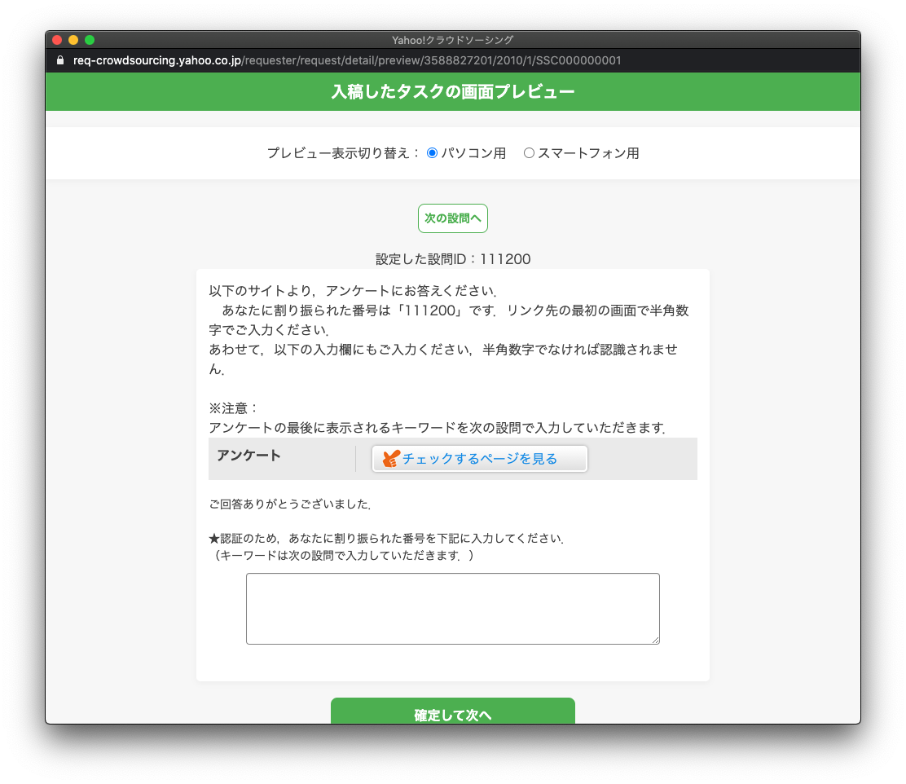

## Y!クラウドソーシングでタスクを発注しよう

## 今日やること

### 絶対にやること

* 経済ゲーム実験の発注
* 成果報酬用タスクの発注
* Tips

## 今日できないこと

* Y!クラウドソーシングの契約
  * 奥川さんに直接ご連絡をお願いいたします．
* 普通のアンケートの発注
  * 奥川さんのパートでお話いただけているかと思います．

## 経済ゲーム実験の発注

---
### 確認：ここでいう経済ゲーム実験とは
* いわゆるゲーム実験だが，「成果報酬を支払う場合＝Y!クラウドソーシング上でのIDとゲーム実験上のIDを連結する必要がある場合」を指している．

## タスク情報の入力

### Step 1：タスク説明情報

* タスク名

> 人工知能との付き合い方に関する実験

* タスクの説明文

> これは人工知能との付き合い方に関する実験です．
>
>
> １．研究の目的
> このアンケートでは，みなさんが「人工知能エージェント」に対して，どのように反応するのかを調査します．また，一部には実験的な要素も含まれております．別リンクに飛んで問題文をよく読んで実施いただけると幸いです．
>
> ２．実験参加者として必要とされること
> 実験参加者として必要とされることは，これから行われる各項目への回答です．また，最後にキーワードを提示します．そのキーワードをY!クラウドソーシング上の画面に入力することでPayPayボーナスライトを獲得することができます．
> 最後まで回答してキーワードの入力までを完了させた方には，実験結果に応じて最大で150ポイントを付与します．
> この追加ポイントは1週間以内に付与しますので，Y!クラウドソーシングの画面を適宜確認しておいてください．
>
>
> ３．研究において実験参加者が受ける可能性のあるリスク
> 本研究で得られたアンケートの結果は，本研究の目的のためにだけ使用されます．また，本研究では，住所や氏名など個人が特定されるような情報を実験実施者は獲得しません．そのために，アンケート参加者が受ける個人情報の保護に対するリスクはほぼ皆無であると考えられます．
>
> 調査結果は教育・研究目的にのみ利用し，それ以外の目的に利用することはありません．
> また，各個人が特定されることもございませんので，安心してご回答ください．

### Step 2：ポイント進呈方式の設定

### 

### Step 3：タスク数とオプション設定

### 【確認】タスク数とお見積金額

### Step4：タスク設定

## 設問データ入稿ファイルアップロード

### アップロード画面

### ファイルの作成

* txtファイルをたたき台とします．
  * たたき台ファイルは[コチラ](upload.txt)
  * ダウンロードしてEXCELで開かれると良いと思います．

### 再びアップロード画面

### 発注前の画面確認

### Step 4：タスク設定

## 成果報酬タスクの発注

### 確認：ここでいう成果報酬タスクとは

* 経済ゲーム実験を実施した後に，成果報酬を支払う必要があります．

* 実際には，ここで述べたタスクを複数（報酬の種類の分）作成することになります．

  

### Step1：タスク説明情報

### Step2：ポイント進呈方式の設定

### Step4：タスク設定

### ホワイトリストの作成

### Step4：再びタスク設定

### 設問入稿画面

### 設問設定内容確認画面

### 発注前の画面確認

## Tips

* 成果報酬支払いの時には「複製タスク作成」を使うと，楽に複数タスクを発注できる．

## お疲れさまでした．

