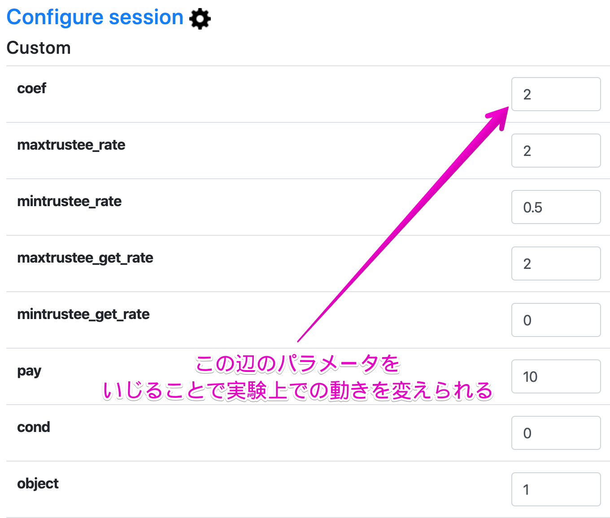
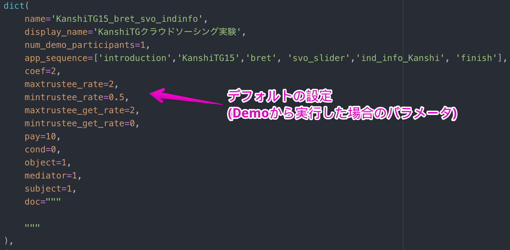

## Fieldについて

### oTreeでは以下のField形式を扱うことができる．

* BooleanField (for true/false and yes/no values)
  * ブーリアン型，True/FALSEやYES/NOなど．
  * 1/0の値を入力するのにも使える．

* CurrencyField
  * 通貨型
  * 金額を扱う時に使う
  * `settings.py`で`REAL_WORLD_CURRENCY_CODE`や`LANGUAGE_CODE`，`USE_POINTS`の設定に応じて「XXポイント」「XXpoints」「$XX」と言った表記をしてくれる．

* IntegerField
  * 整数型

* FloatField
  * 単精度浮動小数点型？
  * 小数を入れられる

* StringField
  * 文字入力ができる．

* LongStringField
  * （長い）文字入力ができる．


その他Tips

### 日本語にしよう
* `settings.py`の中で書き換えるといける．

```
# ISO-639 code
# for example: de, fr, ja, ko, zh-hans
LANGUAGE_CODE = 'ja' # 最初はenになっている．

# e.g. EUR, GBP, CNY, JPY
REAL_WORLD_CURRENCY_CODE = 'JPY' # 最初はUSDになっている．
USE_POINTS = True
```
* ちなみに，ここでは「ポイント」を使っているけど，円表記も可能．


### 実際のプログラムでのインストラクション

* 実は最初のルール説明用画面とインストラクションを別に作っている．
  - インストラクションは常には表示したくないけど，必要なときには表示できるようにしたい．
  
  - 埋め込み表示ができるので，最初のルール説明用画面に別途ファイルで用意したインストラクションを埋め込んでいる．
  
  - ボタン1つで表示したり閉じたりできる．
    

### Rooms機能を使う
  * Rooms機能：実験参加者に割り振るIDを設定する．
  * 上部に記載されている**Rooms**→**Econ 101 class**をクリックして挙動を確認しましょう．
    * `Session config:`で**Public Goods**を選びます．
    * `Number of participants`は**3**とします．
    * `http://localhost:8000/room/econ101/`のリンクをクリックしてください．
    * 次の画面で**Alice**，**Bob**か**Charlie**と入力してください．
    * 実験が開始します．
    - `Sessions`という機能を用いることもできる
      - ランダムな文字列URLが発行されるので，実験の際には`Rooms`の方が使い勝手が良い．


### Rooms機能の設定方法

`settings.py`にはこのように記載されています．
```Python
ROOMS = [
    dict(
        name='econ101',
        display_name='Econ 101 class',
        participant_label_file='_rooms/econ101.txt',
    ),
    dict(name='live_demo', display_name='Room for live demo (no participant labels)'),
]
```

* ここの`name`に当たるところが先程のURLの`room`以下に続きます．
* `display_name`は画面に表示される名前です．
* `participant_label_file`でIDを登録，指定することができます．


それでは，，`_rooms/econ101.txt'`を見てみましょう．

```txt
Alice
Bob
Charlie
```
…と記載されています．
* `_rooms/`以下にテキストファイルでIDを保存すれば，実験参加者IDを登録することができます．

* 実験で使う場合には適当にIDを発行して，授業で使う時には学生番号を入力するようにしています．


### 下の変な説明がうざめ．

* 実際に実験を行う際には`setting.py`の中で下記のコードを記述して，環境変数の中で	`STUDY`に設定すると良いらしい．
```
AUTH_LEVEL = environ.get('OTREE_AUTH_LEVEL')
```
* しかし，あまりに言うことを聞いてくれないので頭に来たから以下のようにしたら動いたので，これで十分．

```
AUTH_LEVEL = 'STUDY'
```


### ホントはデータベースにはこだわりたい．

* oTreeの開発者いわく，容易に動作検証ができるようにデータベースソフトとして`SQLite`を使っているけどあんまりおすすめしないらしい．
* 本番の実験を行う時には`PostgreSQL`を使う方が良いとのこと
    * [We recommend you use PostgreSQL.](https://otree.readthedocs.io/en/latest/server/server-windows.html?highlight=auth_level)
* `settings.py`に以下のコードを書き足したりして使う．
    * もちろん，その前に設定が必要
```
postgres://postgres@localhost/django_db
```

* あわせて`psycopg2`というPythonパッケージが必要になる．

```
pip install -U psycopg2
```


### 最近の武器は"intro.js"
* オンライン実験をする際に，インストラクションを読ませるためには様々な工夫が必要
  - 今回は紹介しきれなかったが，結構いける！
  - [intro.js](https://introjs.com/)を使って動的なインストラクションを作成している．
  - 割と悪くない＆oTreeを使った教育的コンテンツの開発には使えるかも．
  - "intro.js"の有無による行動変化をもう少し分析したい．


### もちろん可視化もいける！
* グラフィカルなフィードバックは教育的にも研究的にも興味深い
  - [highcharts](https://www.highcharts.com/)を[XEE](https://xee.jp/)の開発者の林さんに教わってチャレンジ！
  - 今回は紹介しきれなかったが，結構行ける！
  - けど，ギリギリのバグがあったりして死にかけてました．泣


### PGGで変数を2倍じゃなく3倍とか，自由に変えたい．
* いくらでも変えられます．
  - 前もってちょっと手を加えればGUI的に変えられたりします．
- 一番いいのはsetting.pyの**session config**に手を加えるのが一番



* `settings.py`での書き方



* これだけでなく，アプリ内のプログラムも書き換える必要がある．
  * またどこかの機会でまとめます．


### 動作検証をするのがめんどくさい

* oTreeには`bot`という機能がある．
* この機能を使うと動作検証が容易になる．
  * 今慌てて勉強中です．またどこかの機会でまとめます．
* 本家サイトに細かく説明が書いてある．
  * [コチラ](https://otree.readthedocs.io/en/latest/bots.html)や[コチラ](https://otree.readthedocs.io/en/latest/misc/bots_advanced.html#)


### 途中離脱が起こったらどうしよう？

* クラウドソーシングなどで実験をすると途中離脱がよく発生する．
* 対応策：時間制限を設けて，その時間を超えたらある値が自動的に入力されるようにする．
  * 時間制限の功罪はあれど，今の所それしか手がない．．．？
  * [コチラ](https://otree.readthedocs.io/en/latest/timeouts.html#forms-submitted-by-timeout)などを参考にされると良い．


### 実際によく使う`if`
  * 例えば，勝った場合と負けた場合の表示を変えたいなど．
  * `if`を使います．
  
```html
 あなたの勝ち！ 
```

```html

    正の数

    負の数

```


### 動画・画像を入れたい！

* YouTubeを入れてみる．

```html

```

* 画像を入れてみる．
  * 外部サイトではなく，oTreeのプロジェクトフォルダの中に入れられる．
  * `_static/`の中に保存する．
  * 画像がいっぱいになるとわからないので，実験ごとにフォルダを用意しておくと良い．


```html

```

